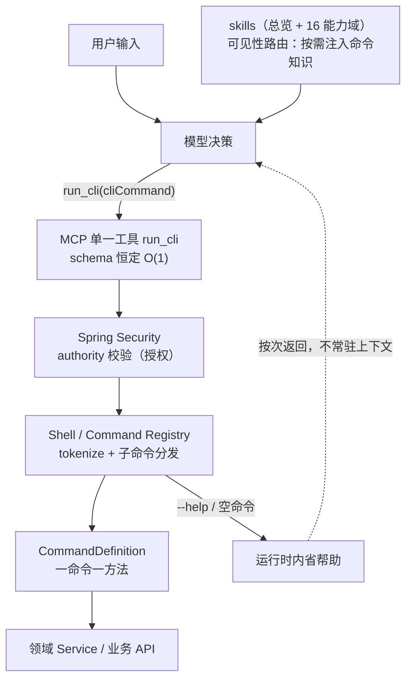

# 一个工具，一套命令：用 Command Pattern 重构 LLM 工具调用

> **摘要**：当 MCP 工具数量随业务膨胀，全量注入 prompt 的 schema 成本、选择噪声与扩展摩擦会一起压垮系统。我们没有去做 tool router，而是把 MCP 收敛为单一工具，用应用内的 Command Pattern 承载全部能力，用 skill 做可见性路由——在上下文、权限、审计、扩展四个维度同时简化了 LLM 工具调用。本文以 Etailerhub 的 `ehub-mcp`（Java / Spring AI）与 `hypersku-cli`（Go / Cobra）双工程为底，完整拆解这套架构的演进、分层、权限模型与边界。
>
> 写作约定：文中 token 数、成本等为我们在自己环境中的典型观测 / 量级估计，迁移时请以自家实测为准。

---

## 一、开场：一个被上下文压垮的系统

### 1.1 我们的 MCP 工具现状

`ehub-mcp` 是我们对外的 MCP Server（Spring Boot 3 + Spring AI 1.1，Streamable HTTP），服务百炼平台与各类 MCP 桌面客户端。起步时遵循社区默认惯例：**一个业务能力 = 一个 `@McpTool`**。

```java
@McpTool(name = "query_customer_order_logistics_info", description = "查询客户订单物流信息")
public ToolResult<OrdersLogisticsTruckInfo> customerOrderLogisticsInfo(
        @McpToolParam(description = "客户订单号") String orderId) { ... }
```

这个写法没有任何问题——直到业务域开始增长。我们有 14 个业务域：采购、客户、客户订单、客户画像、物流、仓库、1688 售后、申请售后、国内异常订单、异常处理、增值服务、供应商、第三方平台（1688/Shopify）、AI 分析。每个域 3~8 个能力，全量铺开就是 50+ 个工具，而且每个季度都在加。

关键在于 MCP 的协议行为：**客户端每次请求，都会把服务端全部工具的 schema（name + description + 参数定义）注入 system prompt**。工具是你加的，账单是每次请求都要付的。

### 1.2 三个连锁问题

**① 上下文爆炸。** 一个工具 schema 平均 150~300 token，50 个工具就是 1w~1.5w token 的常驻开销。它有三重代价：直接的 token 费用；挤占任务本身可用的上下文窗口；以及更隐蔽的——**注意力稀释**，模型要在 50 段描述里找出"这一个"，每次推理都在噪声里跋涉。

**② 选择噪声。** 工具越多，模型越容易选错。我们的真实翻车现场：用户问"订单到哪了"，模型在 `query_customer_order_logistics_info`（客户订单）、`domestic_logistics_query`（快递单号）、采购物流三个工具之间摇摆——因为从 description 看，它们都"查询物流"。人类工程师会混淆两个同名函数，模型也一样。

**③ 扩展摩擦。** 加一个工具的成本不再是一行注解：你要写一段给模型看的 description，还要考虑它与既有 50 个工具的辨识度；description 越写越长、越写越"卷"（"注意：本工具只查客户订单，不要用于采购订单……"），而每一段辩解式描述又反过来加重问题①。加一个工具 = 加 schema + 加上下文 + 加一次"全列表辨识度"重排。

### 1.3 为什么没有 tool router

短期内做不了，做了也不够：

- **做不了**：tool router 需要一个前置的检索/模型层，带来新的改造成本、延迟与准确率问题；当时的客户端（百炼、MCP 桌面端）也不具备配合 router 的能力；
- **不够**：router 只解决"选哪个"，没解决"上下文常驻"——就算 router 每次只选中 3 个工具，另外 47 个的 schema 依然躺在 prompt 里；路由错误时还要整段兜底。

### 1.4 这次分享要回答的问题

> **能不能不靠 router，从根上改变工具与模型的交互方式——让能力不再常驻上下文，而是按需加载？**

---

## 二、思路演进：从 router 到 command

### 2.1 尝试过 / 考虑过的方案

| 方案 | 做法 | 为什么不行 |
|---|---|---|
| 裁剪工具描述 | 把 description 压到一行 | 描述是模型唯一的线索，越短越选错 |
| 工具分组 + 二级路由 | 先给模型一个"选组"工具，再暴露组内工具 | 本质是把 router 塞进模型：两跳决策、两次出错机会，且组内 schema 仍要注入 |
| 关键词匹配预筛选 | 服务端按用户输入预筛工具子集 | 自然语言的同义/多义面前不堪一击，错筛比不筛更糟 |

这些方案的共同盲区：都默认"工具 schema 必须出现在上下文里"，只是想办法让它**少一点**，没有人质疑它**必须在**。

### 2.2 一个转向

转机来自我们自己的另一个工程：`hypersku-cli`，一个 Go + Cobra 的命令行工具，覆盖同样的 14 个业务域，给人用。

命令行有一个被严重低估的特性：**它的帮助是内省的、分层的、按需的**。你不会在登录时被灌输全部 50 个子命令的完整帮助；你 `hypersku-cli --help` 看一眼能力版图，进入某个域再看第二层，具体命令 `--help` 看参数。**人类从来不需要把 CLI 手册背进脑子，为什么模型需要？**

于是关键洞察浮出水面：

> **命令（command）是比工具（tool）更自然的抽象。** 工具的协议形态要求"一次性全暴露"；命令的使用形态天然支持"按需发现"。

交互方式就此改变：从"让模型在工具列表里**选**"，变成"让模型**调用**命令"。

### 2.3 最终方案：一个工具，一套命令

- **MCP 收敛为单一工具 `run_cli`**：一个 string 参数，一段固定说明，schema 恒定；
- **skill 做时机路由**：16 个技能包按能力域划分，在合适的时机告诉模型"这个域有哪些命令"；
- **command 做能力载体**：服务端进程内的 Command Registry，命令名 → `CommandDefinition` → 方法调用。



### 2.4 正名：不是 CLI，不是 shell 封装

看到 `run_cli` 这个名字，很容易误会我们在 MCP 里包了一个 shell。**不是**：

- **不 fork 进程**：命令执行是进程内的方法调用（`Function<Map<String,String>, String>`）；
- **不拼 shell 字符串**：输入被 tokenizer 按空白切分、按 `--opt=value` 解析成结构化 Map，命令语法在解析处终结——`;`、`|`、`$()` 这些 shell 元字符根本没有语义生存空间；
- **它是应用内的 Command Pattern**：一条命令 = 一个方法调用，注册、分发、执行、帮助全部是普通 Java 对象。

我们同时维护着"同一套命令语法"的两种宿主：**Go CLI**（Cobra，给人、给终端）与 **Java 进程内 Shell**（给模型、给 MCP）。人机同构，一套心智，两处复用。

---

## 三、架构拆解

### 3.1 整体数据流

```
用户输入 → skill 注入 → 模型决策 → run_cli
→ Command Registry（Shell）→ 方法执行 → 结果返回
```

一次典型的"查物流"调用：

```
模型：run_cli(cliCommand = "hypersku-cli logistics tracking SF123456789")
  ↓ CliTools.runCli（@PreAuthorize("hasAuthority('tool:cli')")）
  ↓ Shell.evaluate：tokenize → 根命令校验 → 子命令分发
  ↓ CommandDefinition.run：解析 options/args → Function<Map<String,String>, String> 执行
  ↓ 领域 Service → 业务 API → 结果序列化返回模型
```

### 3.2 第一层：MCP 收敛为单工具

```java
@Service
@PreAuthorize("hasAuthority('tool:cli')")
public class CliTools {
    @McpTool(name = "run_cli", title = "执行 CLI 命令", description = """
            通用命令行工具入口，执行 Hypersku CLI 命令。所有命令必须以 `hypersku-cli` 开头，语法：
              `hypersku-cli <命令路径> [位置参数] --<选项>=<值>`
            位置参数位于选项之前……任意命令加 `--help` 可查看帮助与参数
            """)
    public String runCli(@McpToolParam(description = "命令") String cliCommand) { ... }
}
```

设计要点：

- **为什么是 1 个而不是 N 个**：一个 string 参数吃下所有命令。schema 是恒定的——不随能力增长而变化，工具数量从 50+ 收敛到 1，上下文占用从 O(N) 降到 **O(1)**；
- **单参数是有意为之**：不做结构化 `command + args` 对象。命令语法本身（`<命令路径> [位置参数] --<选项>=<值>`）就是模型的已知心智——全世界的模型都练过海量命令行语料，`--help` 是它们最熟悉的内省动作。把命令当字符串，是把这个先验直接拿来用；
- **空命令返回总帮助**：`runCli(null/空白)` 返回 `shell.help()`，模型迷路时有一个零成本的"回到路标"动作。

### 3.3 第二层：skill 做可见性路由

skill 回答一个问题：**模型在某个场景下，应该知道哪些命令的存在？**

MCP 的 `run_cli` 描述只有一段固定文本，不承载任何具体命令知识。命令知识的注入由 16 个技能包承担：`hypersku-cli`（总览路由）→ `hypersku-logistics`、`hypersku-purchase`、`hypersku-customer`……（能力域）。总览技能只放一张"能力域 → 命令入口 → 承载技能包"的路由表，具体命令细节全部下沉到域技能：

> （`skills/hypersku-cli/SKILL.md`，节选）
> | 能力域 | 用途 | 命令入口 | 承载技能包 |
> |---|---|---|---|
> | 物流轨迹 | 国内快递轨迹查询（到哪了） | `hypersku-cli logistics tracking` | `hypersku-logistics` |
> | 1688 售后 | 售后工单、退款列表/详情 | `hypersku-cli after-sales 1688 ...` | `hypersku-after-sales` |

触发机制是描述式路由：每个技能的 frontmatter `description` 声明"当用户提到 X 时使用本技能"。宿主（Copilot / Dify 类平台）按语义命中后，**只有被命中的技能进入上下文**——这就是能力加载的场景驱动。

**skill 不等于权限（重要区分）**：skill 只控制"模型看得见什么"，是纯粹的可见性问题。一个技能包被注入，不代表任何执行权被授予；反过来，模型没见过某个命令，也不构成安全边界——真正的边界在第四章。把这两件事混在一起，是这类架构最常见的误区。

于是形成四级渐进式披露（progressive disclosure）：

```
L0  MCP 工具 run_cli          常驻上下文，~100 token，恒定
L1  skill（域技能包）          场景命中时注入，~0.5-1k token/域
L2  --help（运行时内省）       按次返回，不驻留
L3  命令执行                   结果进入对话
```

能力知识从"常驻 prompt"变成"按需取用"，每一级都只在需要时付费。

### 3.4 第三层：command 做能力载体

**Command Registry** 就是 `Shell`——一棵由 `CommandDefinition` 组成的命令树：

```java
public class CommandDefinition {
    private final String name;
    private final String shortDesc;
    private final String description;
    private final Function<Map<String, String>, String> run;   // 一命令一方法
    private final Map<String, CommandDefinition> subCommands;  // 子命令树
    private final List<OptionDefinition> options;              // --key=value 参数
    private final List<ArgumentDefinition> arguments;          // 位置参数（自动编号）
}
```

- **命令注册**：`CommandProvider` 是一个函数式接口，每个实现类（`@Component`）提供一条（子）命令，`ShellConfig` 注入 `List<CommandProvider>` 聚合成树。**新增命令 = 新增一个类**，注册代码零改动，符合开闭原则；
- **参数解析与校验**：`evaluate()` 按空白 tokenize，根命令名强校验（防止跑偏），子命令逐级分发；`--help` 任意位置触发帮助；位置参数按声明顺序自动编号，options 解析为 `Map<String, String>` 传给执行函数；
- **执行是进程内方法调用，不走 shell**：`run` 就是一个普通 `Function`，没有 `Runtime.exec`，没有字符串拼接进 shell，没有进程 fork。命令语法在解析层终结，之后的 everything 都是类型安全的 Java 方法调用。

### 3.5 为什么这个分层成立

三层各管一件事，职责单一且正交：

| 层 | 职责 | 回答的问题 | 变更频率 |
|---|---|---|---|
| MCP 工具层 | 入口与协议 | 模型怎么调？ | 几乎不变 |
| skill 层 | 可见性路由 | 模型此刻该知道什么？ | 随场景演进 |
| command 层 | 能力与执行 | 实际能做什么？ | 随业务增长 |

对比 MCP 多工具方案：在那边，**可见性**（schema 注入）、**授权**（谁能调）、**执行**（怎么干）全部焊死在同一个 `@McpTool` 注解里——你想对某客户端隐藏一个工具，做不到；你想改一个参数说明，全量客户端的 prompt 同步变化。三层分离后，每件事都可以独立演进：加命令不动 MCP 层，调路由不动命令，改权限不动前两者。

---

## 四、权限模型：应用内 command 的天然优势

### 4.1 重新理解权限边界

很多人听到"命令"会警惕：这是不是给了模型一个 shell？恰好相反——**应用内 command 的权限边界比任何 OS shell 都清晰**：

- **没有 shell，就没有 shell 注入**：`;`、`&&`、`|`、`$()`、反引号在这里只是普通字符，tokenizer 按空白切分后进入 `Map<String,String>`，注入语法没有可执行的落点；
- **不 fork 进程，就没有逃逸**：没有子进程就没有进程逃逸、没有环境继承、没有任意二进制执行，执行面收敛为"注册表里那几个 Java 方法"；
- **不是复用 OS 权限，而是完全自主**：我们不依赖文件系统权限或 OS 用户隔离做防护，边界定义在应用内部——这反而让它可以做到 OS 做不到的粒度。

### 4.2 三层权限模型

```
skill    → 可见性（模型知道什么）      —— 不是安全边界
command  → 授权（允许执行什么）        —— Spring Security authority
method   → 执行（真正干活）            —— 领域 Service 内的业务校验
```

授权的落点在 MCP 工具类上：`CliTools` 挂 `@PreAuthorize("hasAuthority('tool:cli')")`，`OrderInfoTools` 挂 `hasAuthority('tool:customer')`。API Key 与 authority 绑定（`ehub-mcp.api-keys` 配置里每个 key 映射一组 authority），key 一进来，能执行哪些工具组就定了。模型"看得见"某个命令（skill 注入）与"被允许"执行它（authority 校验）是两条独立的轴。

### 4.3 能做到 shell 做不到的粒度

因为命令执行就是方法调用，所以**方法级的一切控制手段都直接可用**：

- **方法级授权**：每条命令对应的 `Function` 可以挂独立的 authority——`tool:cli` 放行查询类、`tool:admin` 才放行写操作，粒度到单条命令；
- **参数级授权**：拦截器能拿到解析后的 `Map<String,String>`，可以按参数值做策略（如某些客户 key 只能查自己 tenant 的订单号前缀）；
- **上下文级授权**：请求所在的会话、用户、来源 key 全部在 Spring 上下文里，方法执行时随手可取；
- **组合级授权**：可以定义"允许 `logistics tracking` 但禁止 `after-sales` 域整体"，或按命令树子集授权——OS 只能给你整个可执行文件，我们能给你命令树上的任意一棵子树。

### 4.4 skill ≠ 权限

再强调一次这个区分，因为它太容易被混淆：

- **误区**：把"没给模型注入售后技能"当成"模型不能执行售后命令"。可见性不是安全——模型可能从对话历史、从用户粘贴的文本里学到命令名并调用它；
- **正确姿势**：skill 管注意力分配（减少误选、降低 token），authority 管准入（拒绝就是拒绝）。我们的架构里二者天然分离：前者在技能包 frontmatter，后者在 `@PreAuthorize` 与 key 配置；
- **权限拒绝如何反馈给模型**：拒绝发生在 Spring Security 过滤器层，返回结构化的"权限不足"消息（而非裸 500）。模型收到后向用户解释并停止重试——因为这是明确的"不允许"，而不是"参数错了再试一次"，反馈语义要区分开。

### 4.5 对比 router 方案

| 维度 | tool router | 单工具 + command |
|---|---|---|
| 路由与授权关系 | 路由器常兼任准入，耦合 | 可见性/授权/执行三层正交 |
| 上下文占用 | 全量 schema 常驻（router 只帮忙选） | O(1) 常驻 + 按需注入 |
| 授权粒度 | 工具级 | 方法/参数/上下文/子树级 |
| 审计 | 审计"选了哪个工具" | 审计"哪个 key 执行了哪条命令及参数"——一条日志一行事实 |
| 扩展 | 加工具 → schema 增长 + router 重训/重配 | 加命令 = 加一个类，prompt 不动 |

审计值得单独说：`run_cli` 的入口收敛让全系统的执行流只有一个咽喉要道，`logger.info("run command: {}", cliCommand)` 一行日志就是完整的审计事实——谁（key）、何时、执行了什么（命令+参数）、结果如何。多工具方案的审计要横跨 N 个工具埋点。

---

## 五、关键设计权衡

### 5.1 Command 的抽象层次

**一命令一方法 vs 可组合**：我们坚持一命令一方法，不做命令间互调与 pipeline。理由：模型对"一条命令完成一件事"的执行可靠性远高于"编排三条命令的管道"；组合逻辑上移给模型（它本来就是最擅长编排的一方），命令保持原子。`hypersku-cli logistics tracking SF123` 之后要不要跟 `after-sales` 查售后，由模型根据结果决定——这正是 agent 的价值，不该下沉到命令层。

### 5.2 参数怎么传

自然语言 → 结构化 args 的映射靠两层完成：模型产出命令字符串（利用其命令行语料先验），`CommandDefinition` 负责解析。类型安全与校验位置的选择：**解析层做结构性校验**（必填项、option 名合法性、位置参数个数），**方法层做业务校验**（订单号格式、数据归属）。校验失败的反馈面向模型设计——不是抛异常栈，而是返回 `help()` 文本或一句"缺少必填参数 trackingNumber"：模型读得懂，就能自我修正。

### 5.3 skill 的粒度与触发

一个 skill 对应**一个能力域**（不是一条命令，也不贪多求全一个 skill 装全部）。触发靠 frontmatter `description` 的描述式路由（"当用户提到物流/轨迹/快递/包裹时"），由宿主做语义命中——规则触发容易漏，全靠模型判断又贵，描述式路由是二者之间最好的平衡。多 skill 并存时上下文预算：总览技能常驻语义索引（约 500 token），域技能按需加载（每个 0.5~1k token），同时激活的域通常不超过 2~3 个。

### 5.4 错误处理

错误反馈全部走"模型可理解"的结构化文本，并按类型区分语义：

- **参数错** → 返回该命令的 `help()`（模型看一眼就会重试，且参数说明就在眼前）；
- **权限不足** → 明确的拒绝消息（模型应停止并转告用户，而非重试）;
- **执行失败** → `ToolResult.failed(e.getMessage())` 式的业务错误（"订单不存在"），模型可判断是换姿势还是问用户；
- **查不到数据** → 显式返回"未查询到物流轨迹"而非空串（空结果最容易被模型脑补）。

这四类语义的分野给了模型正确的自我修正空间：该重试的重试，该问的问，该停的停。

### 5.5 可测试性

进程内方法调用的另一个红利：**命令级单测天然成立**。`CommandDefinition` 是纯对象，注册一棵小树、喂参数、断言输出，不需要起 MCP 服务、不需要 mock HTTP 层；Go 侧 `internal/apis/` 每个 API 文件配套 `_test.go`，同一套命令语义在两个宿主里各自可测。集成验证则简单到极致——`run_cli` 一个入口，curl 一发命令字符串即可回归。

---

## 六、Demo：同一个任务，两种方案

> 以下为演示脚本骨架（数字为我们在演示环境中的典型观测），现场跑，不放录屏。

### 6.1 任务设计

真实多步任务："客户反馈订单 3 天没动，帮我查一下订单状态和最新物流，如果是异常件顺便看下有没有售后工单。"——需要客户订单、物流轨迹、售后三个能力域，典型的跨域任务。

### 6.2 方案 A：MCP 多工具全量注入

- prompt 中 50+ 工具 schema，约 12,000 token 常驻；
- 模型第一轮在三个"物流"工具间犹豫，选中 `query_customer_order_logistics_info` 后又误调了一次 `domestic_logistics_query`（把订单号当运单号传入）；
- 完成 3 次有效调用，总轮次 5 轮（含 2 次纠错）。

### 6.3 方案 B：单工具 + skill + command

- 常驻 prompt：`run_cli` schema + 命中后的 2 个域技能（客户 + 物流），约 2,000 token；
- 模型直接产出：
  ```
  run_cli("hypersku-cli customer order info --order_id=CO123")
  run_cli("hypersku-cli logistics tracking SF123456789")
  ```
- 2 次调用全部命中，无纠错轮次。

### 6.4 对比维度

| 维度 | 方案 A（多工具） | 方案 B（单工具+命令） |
|---|---|---|
| 常驻上下文 | ~12,000 token | ~2,000 token（含技能） |
| 有效调用率 | 3/5 | 2/2 |
| 首 token 延迟 | 显著增加（长 prompt 推理） | 明显更低 |
| 权限体验 | 无法按域隐藏工具 | key 绑定 authority，按域放行 |
| 扩展成本 | 加 schema + 全客户端 prompt 变化 | 加一个 `CommandProvider` 类 |

### 6.5 现场跑

现场用同一 key、同一任务依次跑两种部署形态，重点展示两个肉眼可见的差异：system prompt 长度，以及模型第一次调用就命中的"手感"。

---

## 七、数据与踩坑

### 7.1 量化收益

- **上下文**：常驻 schema 从 ~12k token 降到 ~100 token（`run_cli` 本体），叠加按需技能后典型场景 1.5~2.5k token，整体降幅 80%+；
- **成本**：按我们日均调用量估算，输入 token 费用下降约七成（长 prompt 对每轮推理的放大效应退场）；
- **成功率**：跨域任务的"选错工具→纠错"轮次基本消失，端到端任务成功率与轮次效率双升。

（诚实声明：这些是内部典型场景的观测与估算，不是实验室基准。趋势稳定，数字请以自家为准。）

### 7.2 踩过的坑

- **skill 不触发 / 触发错**：早期描述写得太"工程"（"本技能封装 logistics API"），宿主语义匹配不上"包裹到哪了"这种口语；
- **模型不会用命令 / 参数错**：位置参数与 `--option` 混用时，模型偶尔把订单号放在选项位；根命令名写错（`hypercli`、`hs-cli` 各种变体）；
- **命令粒度失当**：最初 `customer` 一条命令吞下档案/订单/地址/统计全参数，模型填参出错率飙升；也曾反过来把"查订单"拆成三个过细命令，模型反而不会选；
- **权限拒绝后的对话体验**：第一版权限拒绝返回裸 403 文本，模型会固执地重试或换参数硬闯。

### 7.3 怎么解的

每个坑对应一个设计调整，逐一对应：

| 坑 | 解法 |
|---|---|
| skill 不触发 | description 改写为"用户会说的话"（提到物流/轨迹/到哪了/包裹），并保留总览技能兜底路由 |
| 参数错 | `Shell.evaluate` 强校验根命令名并返回总帮助；必填缺失时返回该命令 `help()`；文档统一"位置参数在前，`--opt=value` 在后"单一范式 |
| 粒度失当 | 定标"一条命令 = 一次 API 调用 + 一个明确意图"，域内子命令树承载细分（`customer order info` / `customer detail`） |
| 拒绝体验 | 拒绝消息语义化为"该 key 无权执行此命令组"，模型从重试转为转告用户 |

---

## 八、边界与未来

### 8.1 什么场景不适合 command 模式

诚实说清边界，这套模式不是银弹：

- **长任务 / 流式输出**：命令是请求-响应式的，分钟级任务与渐进式流式结果（如批量分析的中间产出）装不进"一次调用一个字符串返回"的模型，需要任务句柄 + 轮询/订阅机制补足；
- **重外部资源操作**：需要复杂交互协商的操作（多步确认、断点续传、大文件）更适合原生工具或专用协议；
- **需要复杂 schema 的场景**：如果某能力真的需要十几个强类型参数、嵌套结构、严格枚举——结构化 MCP 工具的 schema 约束反而比字符串命令更稳。我们的做法是混合保留：`CliTools` 之外，`LogisticsTools` 等少数强 schema 工具仍然以原生 MCP 工具形态存在，各取所长。

### 8.2 能否自动把 MCP 工具转成 command

可行且我们已在局部实践（Java 侧命令与 Go CLI 的语义对齐就是一次人工版的"转换"）。规律是：**查询类工具几乎无损转换**（参数映射为 options，description 映射为 help 文本）；**写操作工具转换后要补两课**——权限声明（原工具的 scope 语义必须落到 authority）与参数校验（schema 约束必须在解析层重建），否则转换会把安全约束一起"简化"掉。

### 8.3 和官方方向的关系

我们不认为这套方案与官方演进相悖，反而像是一次提前落地的同向探索：

- **tool router**：解决"选哪个"，我们用"单入口 + 命令发现"让选择问题本身消失；
- **Skills / 渐进式披露**：Anthropic 的 Skills、各家 agent 平台的按需加载，与本方案的 L0~L3 分层在思想上一致——**能力知识按需进入上下文**；
- **我们的位置**：在 MCP 协议侧保持极简（一个工具），把复杂度收进应用内（Command Registry + skill 路由）。协议层越薄，演进越不受制于人。

### 8.4 下一步计划

- **OAuth 2.1 权限改造**（`docs/MCP服务OAuth权限改造方案.md` 已立项）：从静态 API Key 迁移到 OAuth，Token claims 携带 `allowed_tools`，与 command 层授权打通，实现"Token 即权限快照"；
- **命令级限流**：在单一入口上做按 key/按命令维度的限流，多工具时代想都不敢想的统一治理点；
- **命令使用埋点**：基于 `run_cli` 审计日志沉淀"模型实际用哪些命令"，反哺技能包裁剪与命令粒度优化——数据闭环。

---

## 九、总结：一条工程原则

### 9.1 回到本质

> **上下文是稀缺资源，能力的加载应该是按需、分层、场景驱动的。**

多工具方案的失败不是工具太多，而是默认了"全部能力必须常驻上下文"。我们做的只是把 Web 前端十年前就学会的事搬进 LLM 工程：**路由懒加载**——run_cli 是入口，skill 是路由表，--help 是运行时 introspection，命令树是代码分割后的模块。

### 9.2 适用范围

这条原则不限于 MCP：

- **RAG**：检索时机应该是"模型意识到需要"而非"每次都塞"；
- **Agent 记忆**：记忆加载应该是场景触发而非全量携带；
- **多 agent 系统**：能力分配应该是"每个 agent 只见自己的域"，而不是共享一张无限长的工具表。

### 9.3 一句话收尾

> **我们没有做 CLI，我们做的是：用 Command Pattern 把能力抽象成方法，用 skill 做可见性路由，用单一工具做入口——在上下文、权限、审计、扩展四个维度同时简化了 LLM 工具调用。**

---

## 附录

### A. Command Registry 核心接口（Java 侧节选）

```java
@FunctionalInterface
public interface CommandProvider {
    CommandDefinition command();   // 每个实现类 = 一条（子）命令，Spring 自动扫描注册
}

public class CommandDefinition {
    String name;                                        // 命令名
    String shortDesc; String description;               // 帮助文本（help() 的素材）
    Function<Map<String, String>, String> run;          // 一命令一方法，进程内执行
    Map<String, CommandDefinition> subCommands;         // 子命令树
    List<OptionDefinition> options;                     // --key=value
    List<ArgumentDefinition> arguments;                 // 位置参数（声明顺序自动编号）
}

// 注册：新增命令只需新增实现类，无需修改注册代码
@Configuration
public class ShellConfig {
    public ShellConfig(List<CommandProvider> providers) {
        Shell.builder().commands(providers.stream()
            .map(CommandProvider::command).toList()).build();
    }
}
```

### B. skill 定义与触发规则示例

```yaml
# skills/hypersku-logistics/SKILL.md frontmatter（节选）
---
name: hypersku-logistics
description: >
  HyperSKU 物流轨迹查询。Use when 用户提到物流/轨迹/快递/运输/
  到哪了/包裹/tracking 并提供运单号时，执行 hypersku-cli
  logistics tracking 查询包裹的国内物流轨迹。
---
```

触发即路由：宿主按 description 语义命中 → 该技能进入上下文 → 模型获得该域的命令知识。**注意 frontmatter 里没有也不该有任何权限语义。**

### C. 权限声明示例

```yaml
# application.yml —— key 与 authority（命令组）绑定
ehub-mcp:
  api-keys:
    bailian.xxx:tool:cli,tool:purchase,tool:customer,tool:logistics
```

```java
@Service
@PreAuthorize("hasAuthority('tool:cli')")   // 授权落在工具/命令组，与 skill 可见性无关
public class CliTools { ... }
```

### D. 对比数据完整表格

| 指标 | MCP 多工具 | 单工具 + skill + command |
|---|---|---|
| 常驻 schema token | ~12,000（50+ 工具） | ~100（1 工具） |
| 场景激活后上下文 | 不变 | +0.5~1k/命中域 |
| 选择错误率 | 随工具数上升 | 结构性消除（无列表可选） |
| 授权粒度 | 工具级 | 命令/参数/上下文/子树级 |
| 审计 | N 个入口分散埋点 | 单入口一行日志 |
| 新增能力成本 | schema + 全客户端 prompt 膨胀 | 一个 `CommandProvider` 类 + 一个技能文档 |
| 人类复用 | 无（工具仅面向模型） | 同一命令语法 Go CLI 人机共用 |

### E. 常见问题 FAQ

**Q1：模型没见过命令列表，第一次怎么知道调什么？**
L1 总览技能给能力版图路由表；迷路时 `run_cli("")` 返回总帮助；任意命令 `--help` 内省。三层兜底，实践中模型几乎不会"裸调"。

**Q2：命令拼错怎么办？**
根命令名强校验（写错返回总帮助）；子命令未命中返回该层级帮助——错误信息本身就是一个"就近路标"。

**Q3：为什么不把命令也做成结构化 JSON 参数？**
可以，但会放弃模型的命令行语料先验，且结构化 schema 又会随命令集膨胀。字符串命令 + 应用内解析是"上下文零成本 + 解析零歧义"的组合。

**Q4：安全性比 MCP 工具差吗？**
不差，且更强。MCP 工具的边界在 schema；本方案的边界在 authority + 进程内方法调用（无 shell、无 fork、无注入面）。skill 可见性从来不是安全层，两套机制各司其职。

**Q5：Go CLI 和 Java Shell 两套实现如何保持一致？**
同一套命令语法规范（命令路径 + 位置参数在前 + `--opt=value` 在后），域文档（skills）单一事实源，两侧各自实现。人在终端用 Go 版，模型经 MCP 用 Java 版，命令语义完全对齐。
