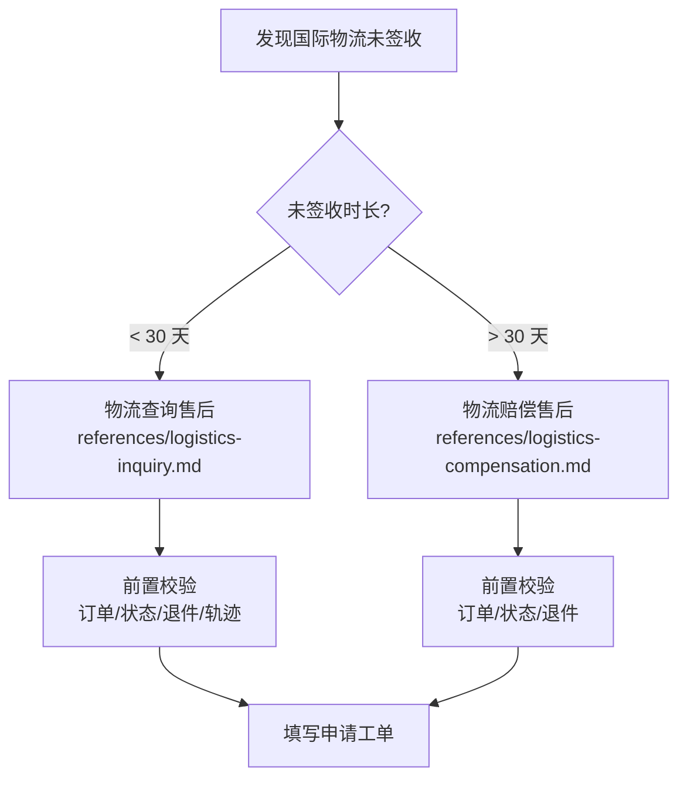

# 申请售后 Skill

本 skill 用于指导针对**国际物流未签收**问题发起售后申请，覆盖两大能力：**物流查询售后**（未签收 < 30 天，找物流公司查询包裹状态）与**物流赔偿售后**（未签收 > 30 天，找物流公司索赔）。

> **数据查询**：订单、退件工单、物流轨迹等数据请配合 [customer](../customer/SKILL.md) 等查询类 skill 使用；本 skill 聚焦"判断该申请哪种售后 → 前置校验 → 填写申请工单"。

## 触发时机

当用户处于以下场景时使用本 skill：

| 场景 | 用户会怎么说 |
|------|-------------|
| 申请物流查询售后 | "包裹好几天没动了怎么办" / "帮我申请物流查询" / "物流一直不更新，申请查一下" |
| 申请物流赔偿售后 | "快递丢了要赔偿" / "包裹这么久没到能索赔吗" / "未签收超过30天了怎么赔偿" |

## 能力总览

| 能力 | 用途 | 适用前提 | 参考文件 |
|------|------|----------|----------|
| 物流查询售后 | 国际物流未签收时向物流发起查询，确认包裹状态 | 物流未签收 **< 30 天** | [logistics-inquiry.md](references/logistics-inquiry.md) |
| 物流赔偿售后 | 国际物流未签收超期时向物流发起索赔 | 物流未签收 **> 30 天** | [logistics-compensation.md](references/logistics-compensation.md) |

## 售后类型判断

## 前置校验

填写申请工单前，需完成前置校验，**任一环节不满足即拦截返回**（详细返回文案见各参考文件）。

### 通用校验（两种售后都执行）

1. **查询订单是否存在**：`hypersku-cli customer order info <customerOrderId>`，订单不存在直接返回。
2. **校验订单状态**：订单状态不是"待收货"且不是"待评价" → 不支持发起售后。
3. **校验海外退件工单**：`hypersku-cli customer order return <customerOrderId>`，存在待处理的海外退件工单 → 不支持发起售后。

### 物流查询售后独有校验

4. **校验国际物流轨迹**：`hypersku-cli customer order logistics <customerOrderId>`，未查询到轨迹或物流已签收 → 不支持发起查询售后。
5. **校验未签收时长**：`hypersku-cli logistics tracking <trackingNumber>`，超过 30 天 → 不支持发起查询售后（应转物流赔偿售后）。

## 申请工单表单项

| 售后类型 | 表单项 |
|------|----------|
| 物流查询售后 | 客户订单号、查询（仓储状态 / 物流状态）、说明 |
| 物流赔偿售后 | 快递单号、物流（已收到货 / 已签收未收到 / 未收到货）、原因、退款（全部 / 其它 / 商品 / 运费）、说明、图片 |

> 各表单项的填写要点见对应参考文件；当前版本校验通过后仅可填写工单，**发起申请接口暂未开放**。

## 意图判断

- 用户提到"**物流不动了/轨迹不更新/帮我查查包裹**"且未签收 < 30 天时，走**物流查询售后**流程。
- 用户提到"**索赔/赔偿/快递丢了要赔**"且未签收 > 30 天时，走**物流赔偿售后**流程。
- 用户只提供订单号、未说明时长时，先按**物流查询售后**排查（查轨迹确认状态并计算未签收时长），再决定是查询还是赔偿。
- 若无法判断，向用户询问未签收时长（< 30 天还是 > 30 天）。

## 注意事项

### 两种售后的关系
- **以未签收 30 天为界**：< 30 天走物流查询售后，> 30 天走物流赔偿售后，不要混用。
- **查询可能升级为赔偿**：查询售后中发现未签收已超过 30 天，应转物流赔偿售后。

### 暂不支持发起
- 当前版本校验通过后仅可填写申请工单，**发起申请接口暂未开放**，需提示用户后续功能支持后再提交。

### 执行约束
- **参数必填**：`<customerOrderId>` 为客户订单号，缺失时命令会自动显示帮助信息。
- **一次一问**：每次只执行一条命令，根据上一步结果决定是否继续。
- **按序校验**：严格按照上述步骤顺序执行，命中拦截条件即返回，不继续后续查询。

### 责任分工
- **采购专员**（主责）：发起查询/赔偿申请、整理材料
- **仓库人员**（配合）：确认签收/入库状态、出具说明
- **财务人员**（配合）：确认赔付金额/到账
