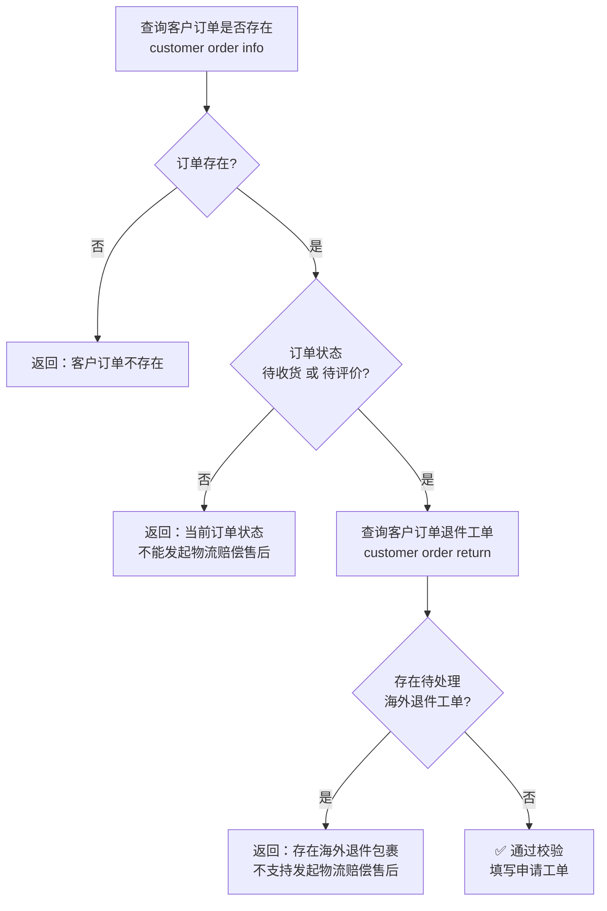

# 物流赔偿售后

> 配套查询命令与字段说明见 [SKILL.md](../SKILL.md)
>
> **适用前提**：国际物流未签收 **> 30 天**，向物流公司发起索赔。
> **责任人**：采购专员（主责），仓库人员（配合出具说明），财务人员（确认赔付金额/到账）。

## 适用场景

**国际段物流已发出且未签收超过 30 天**时，找物流公司索赔。

- 一句话判断：**物流未签收 > 30 天**，找物流公司索赔。
- 若未签收 **≤ 30 天**，不支持发起物流赔偿售后（可参考 [物流查询售后](logistics-inquiry.md)）。

## 申请前置校验

发起物流赔偿售后前，需按顺序完成以下校验，**任一环节不满足即拦截并返回对应文案**：



## 申请步骤

按顺序执行以下步骤，每步校验失败即返回，不再继续：

### 1. 查询客户订单是否存在

```bash
hypersku-cli customer order info <customerOrderId>
```

- 订单**不存在** → 返回**“客户订单不存在”**。

### 2. 校验订单状态

查看订单状态：

- 订单状态**不是"待收货"且不是"待评价"** → 返回**“当前订单状态，不能发起物流赔偿售后”**。

### 3. 校验海外退件工单

```bash
hypersku-cli customer order return <customerOrderId>
```

- 存在**待处理的海外退件工单** → 返回**“存在海外退件包裹，不支持发起物流赔偿售后”**。
- 校验通过 → ✅ 填写申请工单。

## 申请工单表单项

校验通过后，填写物流赔偿售后的申请工单，表单项如下：

| 表单项 | 是否必填 | 填写说明 |
|------|------|----------|
| 快递单号 | 是 | 用户需要申请物流公司赔偿的快递单号 |
| 物流 | 是 | 单选选项：**已收到货**、**已签收（未收到）**、**未收到货** |
| 原因 | 是 | 申请赔偿的原因 |
| 退款 | 是 | 单选选项：全部、其它、商品、运费 |
| 说明 | 是 | 申请赔偿说明 |
| 图片 | 否 | 提交证据图片 |

**填写要点**：

- **快递单号**：用户需要申请赔偿的快递单号，需用户自行确认或填写。
- **物流**：单选选项，选择本次申请退款时物流货物的情况（已收到货 / 已签收未收到 / 未收到货）。
- **原因**：HyperSKU 平台自身原因，简明描述赔偿诉求与异常情况，控制在 80 ~ 150 字。
- **退款**：单选选项，选择本次申请退款的费用（全部 / 其它 / 商品 / 运费）。
- **说明**：提供给物流公司的说明，例如派送异常、签收异常、包裹破损，需提供相关的包裹图片、产品图片，控制在 80 ~ 150 字。
- **图片**：申请赔偿的举证内容。

### 发起申请（暂不支持）

当前版本暂不支持直接发起物流赔偿申请，待对应接口开放后补充。

## 返回文案汇总

| 校验环节 | 触发条件 | 返回文案 |
|------|------|----------|
| 订单查询 | 订单不存在 | 客户订单不存在 |
| 订单状态 | 非"待收货"且非"待评价" | 当前订单状态，不能发起物流赔偿售后 |
| 退件工单 | 存在待处理的海外退件工单 | 存在海外退件包裹，不支持发起物流赔偿售后 |

## 注意事项

1. **按序校验**：严格按照第 1 → 3 步顺序执行，命中拦截条件即返回，不继续后续查询。
2. **参数必填**：`<customerOrderId>` 为客户订单号，缺失时命令会自动显示帮助信息。
3. **一次一问**：每次只执行一条命令，根据上一步结果决定是否继续。
4. **暂不支持发起**：当前版本校验通过后仅可填写工单，发起申请接口暂未开放。
