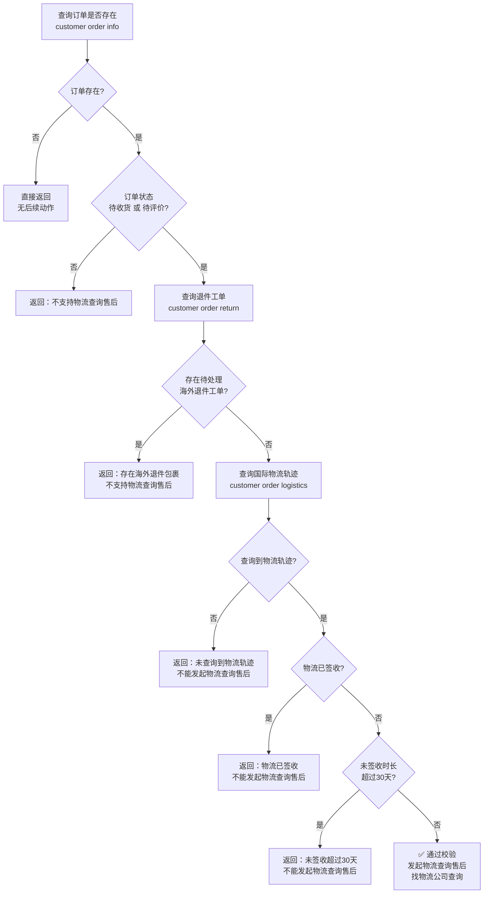

# 物流查询售后

> 配套查询命令与字段说明见 [README.md](../README.md)
>
> **适用前提**：国际物流未签收 **< 30 天**，向物流公司发起查询。
> **责任人**：采购专员。

## 适用场景

**国际段物流已发出但迟迟未签收**，且未签收时长在 30 天内时，找物流公司查询包裹状态。

- 一句话判断：**物流未签收 < 30 天**，找物流公司查询。
- 若未签收 **≥ 30 天**，不支持发起物流查询售后。

## 申请前置校验

发起物流查询售后前，需按顺序完成以下校验，**任一环节不满足即拦截并返回对应文案**：



## 申请步骤

按顺序执行以下步骤，每步校验失败即返回，不再继续：

### 1. 查询订单是否存在

```bash
hypersku-cli customer order info <customerOrderId>
```

- 订单**不存在** → 直接返回，无后续动作。

### 2. 校验订单状态

查看订单状态：

- 订单状态**不是"待收货"且不是"待评价"** → 返回**“不支持物流查询售后”**。

### 3. 校验海外退件工单

```bash
hypersku-cli customer order return <customerOrderId>
```

- 存在**待处理的海外退件工单** → 返回**“存在海外退件包裹，不支持物流查询售后”**。

### 4. 校验国际物流轨迹

```bash
hypersku-cli customer order logistics <customerOrderId>
```

- **未查询到物流轨迹** → 返回**“未查询到物流轨迹，不能发起物流查询售后”**。
- **物流已签收** → 返回**“物流已签收，不能发起物流查询售后”**。

### 5. 校验未签收时长

``` bash
hypersku-cli logistics tracking <trackingNumber>
```

计算物流**多久未签收**：

- 未签收时长**超过 30 天** → 返回**“未签收超过30天，不能发起物流查询售后”**。
- 未签收 **< 30 天** → ✅ 全部校验通过，发起物流查询售后（找物流公司查询包裹状态）。

## 申请工单表单项

校验通过后，填写物流查询售后的申请工单，表单项如下：

| 表单项 | 是否必填 | 填写说明 |
|------|------|----------|
| 客户订单号 | 是 | 订单查询结果中的客户订单号（CustomerOrderId） |
| 查询 | 是 | 二选一选项：**仓储状态** 或 **物流状态** |
| 说明 | 是 | 对本次售后申请的简短说明 |

**填写要点**：

- **客户订单号**：来自 `hypersku-cli customer order info <customerOrderId>` 查询结果。
- **查询**：二选一，按本次诉求选择"仓储状态"或"物流状态"。
- **说明**：简明描述查询诉求与异常情况（如物流停滞时长、最后轨迹时间等），控制在 80 ~ 150 字。

### 发起申请（暂不支持）

无

## 返回文案汇总

| 校验环节 | 触发条件 | 返回文案 |
|------|------|------|
| 订单查询 | 订单不存在 | 直接返回（无文案） |
| 订单状态 | 非"待收货"且非"待评价" | 不支持物流查询售后 |
| 退件工单 | 存在待处理的海外退件工单 | 存在海外退件包裹，不支持物流查询售后 |
| 物流轨迹 | 未查询到物流轨迹 | 未查询到物流轨迹，不能发起物流查询售后 |
| 物流轨迹 | 物流已签收 | 物流已签收，不能发起物流查询售后 |
| 未签收时长 | 超过 30 天 | 未签收超过30天，不能发起物流查询售后 |

## 注意事项

1. **按序校验**：严格按照第 1 → 5 步顺序执行，命中拦截条件即返回，不继续后续查询。
2. **参数必填**：`<customerOrderId>` 为客户订单号，缺失时命令会自动显示帮助信息。
3. **一次一问**：每次只执行一条命令，根据上一步结果决定是否继续。
