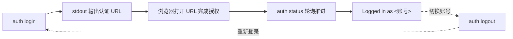

# CLI 登录与状态管理

通过 `hypersku-cli auth` 子命令管理 CLI 的登录状态：发起设备授权登录（Device Code Flow）、查看/轮询登录状态、退出登录并清理本地凭证。其他业务查询命令（purchase/customer/logistics 等）均依赖登录态，未登录时会失败。

## 能力总览

| 能力 | 用途 | CLI 命令 | 参考文件 |
|------|------|----------|----------|
| 发起登录 | 发起设备授权登录，stdout 输出认证 URL 后即退出（默认） | `hypersku-cli auth login` | [login.md](references/login.md) |
| 等待登录 | 发起授权后就地轮询直到授权完成 | `hypersku-cli auth login --wait` | [login.md](references/login.md) |
| 状态校验 | 查看当前登录状态（幂等、无副作用，可轮询） | `hypersku-cli auth status` | [status.md](references/status.md) |
| JSON 状态 | 以 JSON 输出状态（程序化集成场景） | `hypersku-cli auth status --json` | [status.md](references/status.md) |
| 退出登录 | 清理本地凭证与设备授权中间态（幂等） | `hypersku-cli auth logout` | [logout.md](references/logout.md) |

## 意图判断

当用户输入包含以下关键词或意图时，使用对应的子命令：

- 用户提到"登录/登陆/授权/验证链接/设备码/Device Code"时，执行 `login` 输出认证 URL，引导用户在浏览器完成授权。
- 用户提到"等待授权完成/阻塞式登录"时，执行 `login --wait` 就地轮询直到登录成功。
- 用户提到"登录状态/是否已登录/校验登录/凭证是否有效/token 是否过期"时，执行 `status` 查看当前状态。
- 用户提到"程序化获取状态/JSON 格式状态"时，执行 `status --json`。
- 用户提到"退出登录/登出/切换账号"时，执行 `logout` 清理本地凭证；切换账号需先 logout 再 login。

## 登录流程（Device Code Flow）

1. 执行 `hypersku-cli auth login`：CLI 向认证服务申请设备码，**stdout 第一行输出完整的 https:// 认证 URL 后立即退出**（无引号包裹）。
2. 用户在浏览器打开该 URL 并确认授权。
3. 执行 `hypersku-cli auth status` 轮询：若存在进行中的设备授权，status 会自动尝试推进一次（服务端发放 token 后自动保存凭证）。
4. 授权完成后 status 输出 `Logged in as <账号>`（退出码 0）；未登录时输出 `Logged out`（退出码 1）。

## 注意事项

1. **幂等性**：`login` 在已登录时直接提示已登录不报错；`logout` 在未登录时同样正常返回；`status` 无副作用（仅内部推进设备授权）。
2. **退出码约定**：`status` 已登录退出码 0、未登录退出码 1；`status --json` 同样按登录态返回对应退出码，脚本可据此判断。
3. **输出通道**：`login` 的认证 URL 固定输出在 **stdout**（前后空白分隔、无引号），用户码等提示信息输出在 stderr，自动化集成请从 stdout 提取 URL。
4. **切换账号**：需先执行 `logout` 清理旧凭证，再重新 `login`。
5. **前置依赖**：所有业务查询（采购/客户/物流等）均要求已登录，查询失败提示凭证问题时应先 `status` 校验，未登录则走 login 流程。
