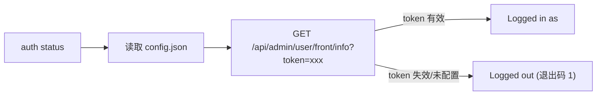

# CLI 登录与状态管理

通过 `hypersku-cli auth` 子命令管理 CLI 的登录状态。登录凭证（`api_base_url` 与 `api_token`）保存在 `~/.hypersku-cli/config.json` 中。其他业务查询命令（purchase/customer/logistics 等）均依赖登录态，未登录或 token 失效时会失败。

当前版本中 `auth login` 与 `auth logout` **暂未实现**（空操作、正常返回退出码 0），凭证由用户手动写入配置文件；`auth status` 通过远程接口校验 token。

## 能力总览

| 能力 | 用途 | CLI 命令 | 参考文件 |
|------|------|----------|----------|
| 状态校验 | 远程校验 api_token，输出当前登录状态 | `hypersku-cli auth status` | [status.md](references/status.md) |
| JSON 状态 | 以 JSON 输出状态（程序化集成场景） | `hypersku-cli auth status --json` | [status.md](references/status.md) |
| 登录（暂未实现） | 空操作，正常返回 | `hypersku-cli auth login` | [login.md](references/login.md) |
| 退出登录（暂未实现） | 空操作，正常返回 | `hypersku-cli auth logout` | [logout.md](references/logout.md) |

## 意图判断

当用户输入包含以下关键词或意图时，使用对应的子命令：

- 用户提到"登录状态/是否已登录/校验登录/凭证是否有效/token 是否过期"时，执行 `status` 远程校验。
- 用户提到"程序化获取状态/JSON 格式状态"时，执行 `status --json`。
- 用户提到"登录/login"时：当前版本 login 为空操作，提示用户手动在 `~/.hypersku-cli/config.json` 中配置 `api_token`（含 `api_base_url`）。
- 用户提到"退出登录/登出/logout"时：当前版本 logout 为空操作，提示用户手动删除配置文件中的 `api_token`。

## 登录状态校验流程

1. `auth status` 读取 `~/.hypersku-cli/config.json` 中的 `api_base_url` 与 `api_token`。
2. 请求 `GET {api_base_url}/api/admin/user/front/info?token=xxx`：token 有效时服务端返回用户信息（id/name/nickname/proxy/roleCode/roles/username）。
3. token 有效输出 `Logged in as <username>`（退出码 0，username 缺省时依次取 name/nickname/unknown）；未配置、失效或请求失败输出 `Logged out`（退出码 1）。

## 注意事项

1. **退出码约定**：`status` 已登录退出码 0、未登录退出码 1；`status --json` 同样按登录态返回对应退出码，脚本可据此判断。
2. **输出通道**：`status` 的结果固定输出在 **stdout**，自动化集成从 stdout 解析。
3. **login/logout 暂未实现**：两者均为空操作（正常返回退出码 0），凭证的写入与清理由用户手动编辑 `~/.hypersku-cli/config.json` 完成。
4. **前置依赖**：所有业务查询（采购/客户/物流等）均要求 token 有效，查询失败提示凭证问题时应先 `status` 校验，再引导用户更新配置文件中的 `api_token`。
