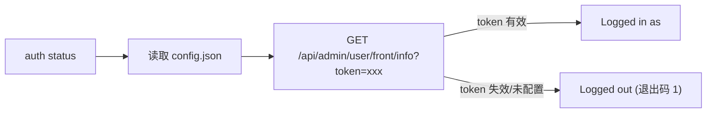

# CLI 登录与状态管理

通过 `hypersku-cli auth` 子命令管理 CLI 的登录状态。登录凭证（`api_base_url` 与 `api_token`）保存在 `~/.hypersku-cli/config.json` 中（首次运行 CLI 自动创建，`api_base_url` 默认 `https://pur.hyperoms.com`）。其他业务查询命令（purchase/customer/logistics 等）均依赖登录态，未登录或 token 失效时会失败。

- `auth login` 支持 access-token 或用户名密码两种方式，成功后自动写入凭证；
- `auth logout` 删除本地配置中的 `api_token` 完成退出；
- `auth status` 通过远程接口校验 token。

## 能力总览

| 能力 | 用途 | CLI 命令 | 参考文件 |
|------|------|----------|----------|
| 登录（token） | 使用已有 access-token 登录并保存 | `hypersku-cli auth login <access-token>` | [login.md](references/login.md) |
| 登录（账密） | 用户名密码登录并保存 token | `hypersku-cli auth login --api-user <u> --api-password 
` | [login.md](references/login.md) |
| 状态校验 | 远程校验 api_token，输出当前登录状态 | `hypersku-cli auth status` | [status.md](references/status.md) |
| 退出登录 | 删除本地配置中的 api_token | `hypersku-cli auth logout` | [logout.md](references/logout.md) |

## 意图判断

当用户输入包含以下关键词或意图时，使用对应的子命令：

- 用户提到"登录状态/是否已登录/校验登录/凭证是否有效/token 是否过期"时，执行 `status` 远程校验。
- 用户提到"登录/login"时：根据可用凭证选择方式——有 access-token 时 `hypersku-cli auth login <access-token>`；有账号密码时 `hypersku-cli auth login --api-user <用户名> --api-password <密码>`。两者均未提供时命令报错提示。
- 用户提到"退出登录/登出/logout"时：执行 `hypersku-cli auth logout` 删除本地配置中的 `api_token`（保留 `api_base_url` 等其他配置）。

## 登录状态校验流程

1. `auth status` 读取本地配置中的 `api_base_url` 与 `api_token`。
2. 请求 `GET {api_base_url}/api/admin/user/front/info?token=xxx`：token 有效时服务端返回用户信息（id/name/nickname/proxy/roleCode/roles/username）。
3. token 有效输出 `Logged in as <username>`（退出码 0，username 缺省时依次取 name/nickname/unknown）；未配置、失效或请求失败输出 `Logged out`（退出码 1）。

## 注意事项

1. **退出码约定**：`status` 已登录退出码 0、未登录退出码 1，脚本可据此判断。`login`/`logout` 成功退出码 0，失败退出码 1。
2. **输出通道**：`status` 的结果固定输出在 **stdout**，自动化集成从 stdout 解析。
3. **凭证读写**：`login` 成功后 token 自动写入本地配置（同时记录 `api_token_updated_at` 更新时间，RFC3339 格式）；`logout` 自动清除 `api_token` 与 `api_token_updated_at`（保留其他配置），均无需手动编辑配置文件。
4. **前置依赖**：所有业务查询（采购/客户/物流等）均要求 token 有效，查询失败提示凭证问题时应先 `status` 校验，必要时重新 `login`。
