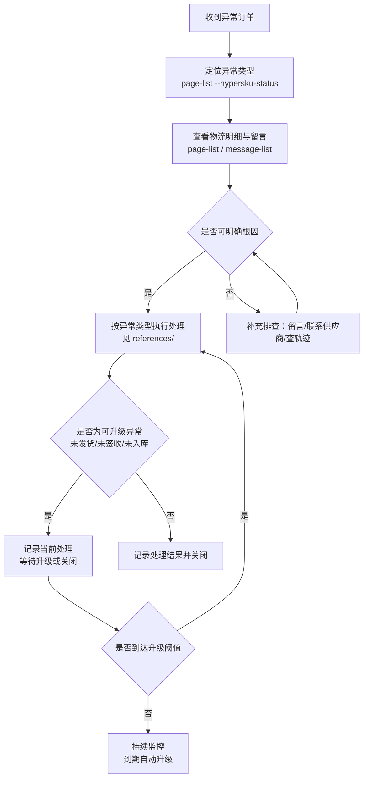

# 国内第三方交易异常订单处理

本文档用于指导处理国内第三方交易异常订单（HyperSKU 在第三方平台 1688/淘宝 等的采购单，其国内段物流异常在此监控）。覆盖**各异常类型的说明、问题排查步骤、下一步处理方案**，配合 `domestic-third-trade-exception` 查询能力使用。

> **数据查询**：订单列表、物流明细、留言记录等数据请使用 `domestic-third-trade-exception` 能力域（`hypersku-cli domestic-third-trade-exception page-list / message-list`）；本文聚焦"判断类型 → 排查根因 → 决定下一步"。

## 触发时机

当用户处于以下场景时使用本文档：

| 场景 | 用户会怎么说 |
|------|-------------|
| 理解异常含义 | "未发货是什么意思" / "为什么会出现假发货" |
| 排查异常根因 | "这个订单为什么丢包裹" / "帮我查一下原因" |
| 确定处理动作 | "接下来怎么办" / "这种情况怎么处理" |

## 处理总流程

> **可升级异常**：未发货→无货、未签收→假签收、未入库→丢包裹。采购专员需在低级别阶段主动介入，争取在升级前解决问题。

## 异常类型总览

| 异常类型 | 一句话说明 | 升级关系 | 处理模板 |
|------|------|------|------|
| 未发货 | 付款 ≥ 48h 商家未发货 | → 72h 升级为"无货" | [01-not-shipped.md](references/01-not-shipped.md) |
| 假发货 | 发货 ≥ 24h 仍无物流轨迹 | — | [02-fake-shipped.md](references/02-fake-shipped.md) |
| 未到货 | 未签收, 物流 ≥ 72h 未更新 | — | [03-not-arrived.md](references/03-not-arrived.md) |
| 假签收 | 快递签收 ≥ 72h, 仓库未签收 | — | [04-fake-signed.md](references/04-fake-signed.md) |
| 未签收 | 快递签收 24~72h, 仓库未签收 | → 72h 升级为"假签收" | [05-not-signed.md](references/05-not-signed.md) |
| 退件 | 快递退回商家 | — | [06-returned.md](references/06-returned.md) |
| 丢件 | 快递丢件 | — | [07-lost-item.md](references/07-lost-item.md) |
| 未入库 | 仓库签收 ≥ 24h, 未入库 | → 72h 升级为"丢包裹" | [08-not-warehoused.md](references/08-not-warehoused.md) |

> **升级说明**：未发货→无货、未签收→假签收、未入库→丢包裹 为同一异常链条的升级关系，超时后自动从低级别升级到高级别，处理动作随之加重（排查 → 退款/赔偿）。

## 通用排查命令

- 查询异常订单列表：`hypersku-cli domestic-third-trade-exception page-list --hypersku-status <主状态> --hypersku-sub-status <子状态>`
- 查看留言记录（供应商/内部跟进）：`hypersku-cli domestic-third-trade-exception message-list <monitorOrderId> <monitorLogisticsId>`

> 注意：MonitorOrderId、MonitorLogisticsId 只能用来查询留言记录，它们只是这条异常记录的关联id，没有其他的业务意义。

## 意图判断

- 用户提到"**为什么/是什么意思/什么原因** + 某异常类型"时，先定位异常类型，再给出对应说明。
- 用户提到"**排查/查一下/看看哪出了问题/怎么确认**"时，按该异常类型的 reference 文档中的"问题排查步骤"逐步执行。
- 用户提到"**怎么办/怎么处理/下一步/要不要退款/要不要补发**"时，按该类型的"下一步处理步骤"给出方案。
- 若用户只给了订单而没有异常状态，先执行 `domestic-third-trade-exception page-list` 定位该订单的异常类型，再继续。

## 注意事项

### 责任分工
- **采购专员**（主责）：负责所有异常订单的联系供应商、物流查询、发起退款/换采、记录处理结果
- **仓库人员**（配合）：确认包裹签收/入库状态、排查漏签漏入、反馈包裹丢失情况
- **财务人员**（配合）：退款到账核销、赔付金额确认

### 处理时效（SLA）
| 异常类型 | 启动时效 | 闭环时效 |
|------|------|------|
| 未发货 / 假发货 | 触发后 24h 内联系供应商 | 48h 内给出处理方案（发货/退款） |
| 未到货 / 假签收 / 未签收 | 触发后 24h 内启动排查 | 48h 内给出处理方案 |
| 退件 / 丢件 | 确认后 72h 内完成与供应商沟通 | 7 天内完成退款/补发 |
| 未入库 | 触发后 24h 内联系仓库确认 | 48h 内确认包裹状态 |
| 丢包裹 / 无货 | 升级后 24h 内启动赔付/退款 | 7 天内完成 |

### 处理原则
- **主动降级**：在低级别异常阶段（未发货/未签收/未入库）主动介入，避免升级为高级别（无货/假签收/丢包裹）
- **先沟通后操作**：联系供应商/物流确认根因后，再决定退款/补发/换采，避免误操作
- **全程留痕**：所有沟通记录通过 `message-list` 可查，关键决策需备注说明

## 待补充清单

- [x] 异常类型总览表中各类型的"一句话说明"
- [x] `references/` 下各异常类型文件中的"异常说明 / 问题排查步骤 / 下一步处理步骤"
- [x] 注意事项中的处理约束（SLA时效、责任人、处理原则）
- [ ] 退款/赔付所需材料清单与金额计算规则（待业务方确认）
- [ ] 联系第三方供应商的标准话术模板
